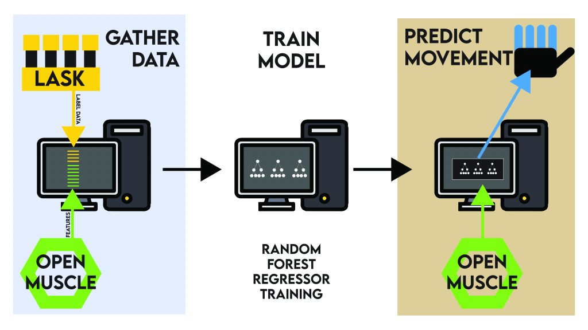

# 🧠 OpenMuscle (Legacy Repository)

> 📢 **NOTE:** This repository is no longer actively maintained.  
> All current work has moved to the new [**Open-Muscle GitHub Organization**](https://github.com/Open-Muscle).  
> Please see the new [OpenMuscle Hub](https://github.com/Open-Muscle/OpenMuscle-Hub) for the latest devices, firmware, and documentation.

---

## ⚡ Quick Links to New Repositories

| Project | Description | Link |
|--------|-------------|------|
| **OpenMuscle Hub** | Central documentation and overview for all OpenMuscle projects | [OpenMuscle-Hub](https://github.com/Open-Muscle/OpenMuscle-Hub) |
| **FlexGrid** | Modular 60-sensor wearable (successor to OM12) | [OpenMuscle-FlexGrid](https://github.com/Open-Muscle/OpenMuscle-FlexGrid) |
| **LASK5** | Labeling device with joystick and buttons | [OpenMuscle-LASK5](https://github.com/Open-Muscle/OpenMuscle-LASK5) |
| **Software** | MicroPython firmware, communication protocols, and ML hooks | [OpenMuscle-Software](https://github.com/Open-Muscle/OpenMuscle-Software) |
| **OM12 Legacy Band** | Historical 12-sensor band hardware | [OpenMuscle-Band](https://github.com/Open-Muscle/OpenMuscle-Band) |

---

## 🧬 About This Repo

This was the **original prototype** of OpenMuscle (OM12 + LASK4), developed to prove out muscle-based finger tracking using off-the-shelf parts and MicroPython.

It remains here for archival purposes and for those referencing:
- Early research and design iterations
- Press and academic mentions (42+ stars)
- Explorations in UDP-based muscle telemetry using hall effect sensors

    

---

## 🧪 Prototype Overview

### 🧠 OM12 – OpenMuscle 12 Sensor Band (v5.3.0)

- 12 Hall Effect Sensors (49E)
- 6 Sensor Cells, dual-input
- PCB 5.3.0
- ESP32-S2
- MicroPython
- 1200 s/s via UDP transmission

### ✋ LASK4 (Legacy)

- 4 pistons
- 4 push buttons
- OLED screen
- ESP32-S2 Microcontroller

> The latest version is [LASK5](https://github.com/Open-Muscle/OpenMuscle-LASK5), with joystick and modular controls.

---

## ✅ Legacy Roadmap (Preserved for Context)

- [x] Create an open-source forearm bracelet (OM12)
- [x] Build a hand gesture labeling device (LASK4)
- [x] Create UDP-based data capture tool
- [ ] Build a hosted data training server
- [ ] Raise community awareness
- [ ] Create pre-production versions of both devices

---

## 🧾 License

This repo remains under the MIT License, but newer repositories may use the CERN-OHL-S v2.0 for hardware components. See the respective repos for details.

---

Made with 💡 by [@TURFPTAx](https://github.com/turfptax)  
Project now maintained at [Open-Muscle](https://github.com/Open-Muscle)
