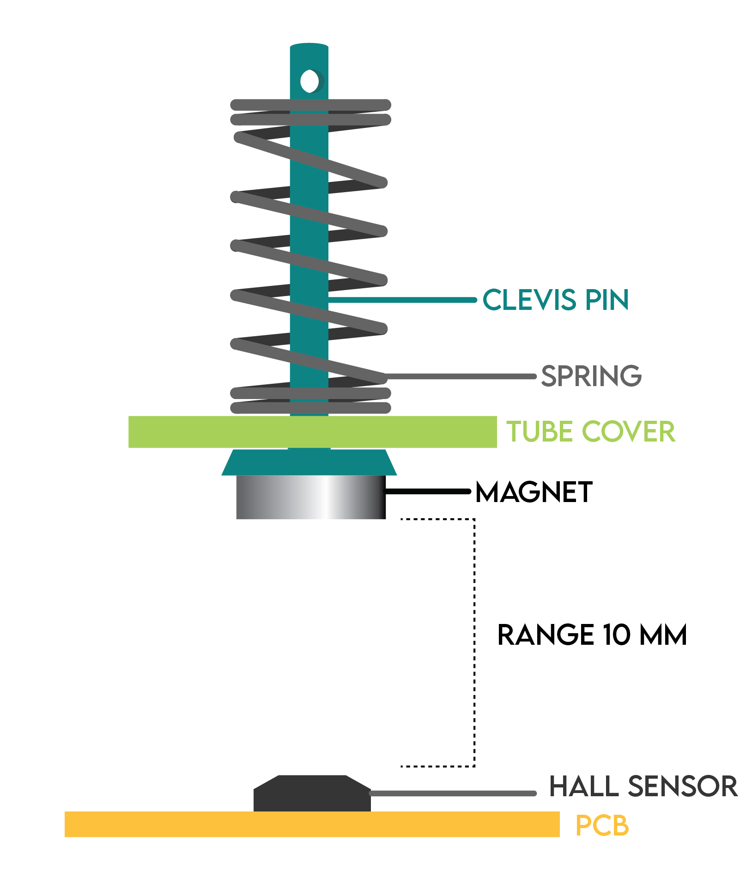

# STL Files for Open Muscle

## OM12 Foam

Most recent design that reduces cost and time of manufactoring

## OM12 Clevis Pin

Best signal-to-noise ratio design. Used for datasetONE and January23.csv

#### Clevis Pin Sensors
 

    
    

